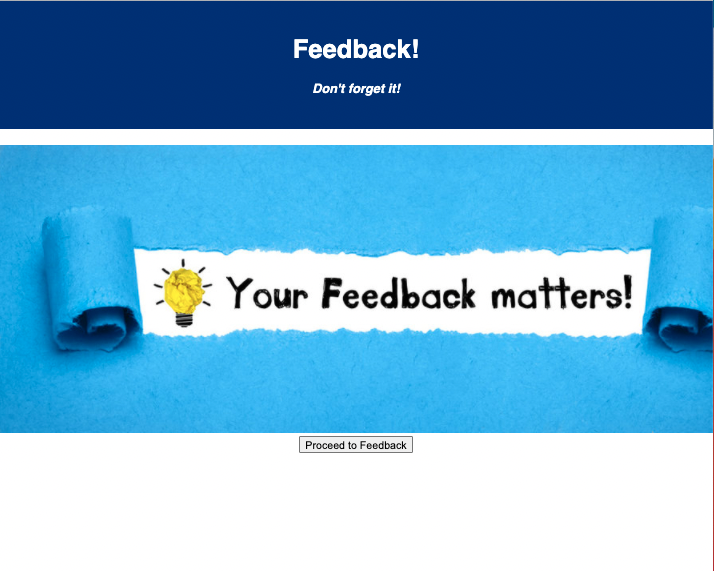
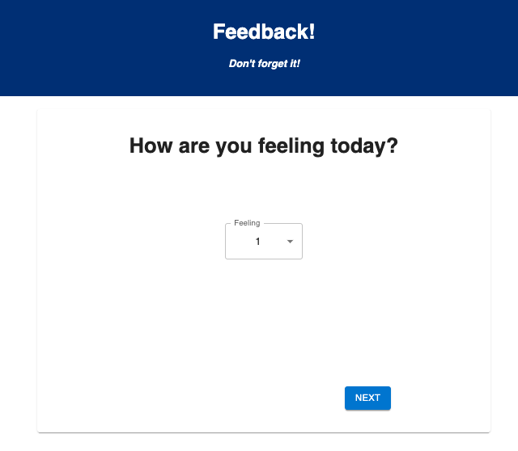
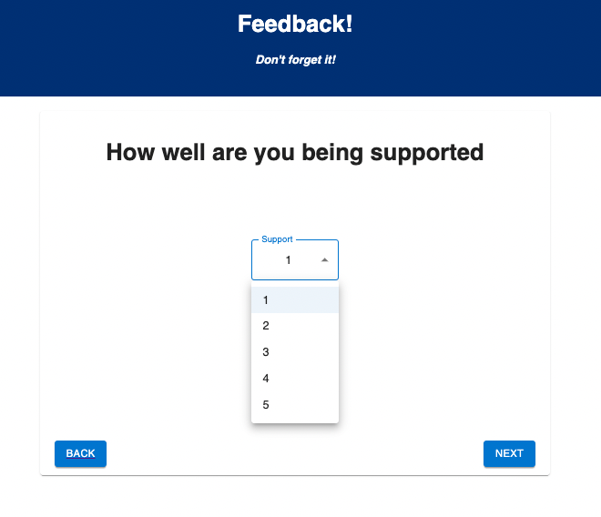
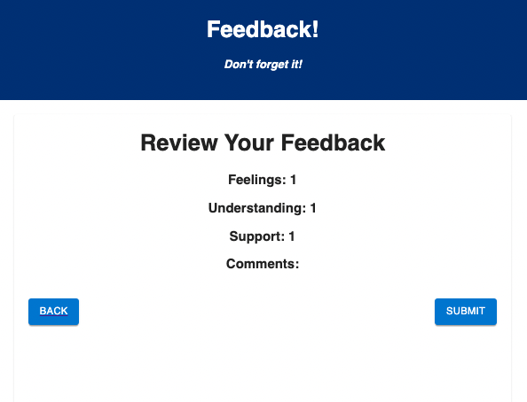
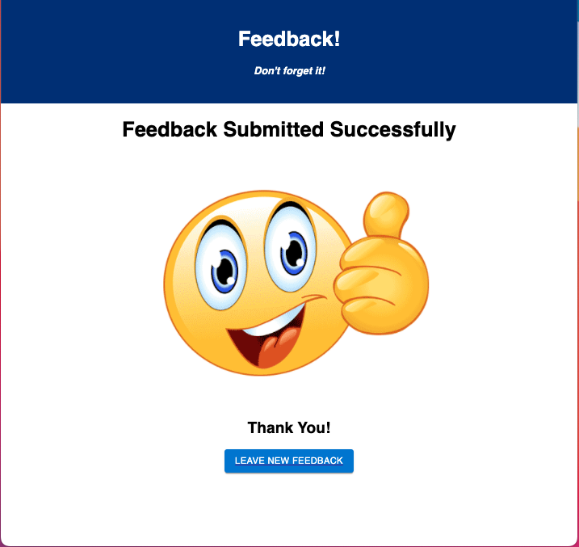

    
    
# Feedback Loop

## Table of Contents

- [Description](#description)
- [Screenshots](#screenshots)
- [Built With](#built-with)
- [Getting Started](#getting-started)
  - [Prerequisites](#prerequisites)
  - [Installation](#installation)
- [Usage](#usage)
- [Contacts](#contacts)

## Description

This is a React-Redux App for a small feedback loop. You are asked some questions and at the end, you get an overview of your response before submission.

## Screenshots

## Built With

## Getting Started

Run these in the terminal

npm install
npm run server
npm run client

### Prerequisites

Must have
postgreSQL
npm

### Installation

How do I get your project running?

## Usage

How do I use your project

## Contacts

  
